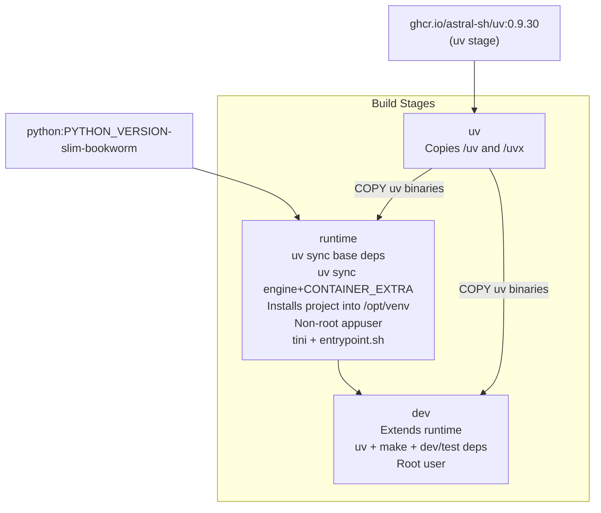

<!-- SPDX-FileCopyrightText: Copyright (c) 2025-2026 NVIDIA CORPORATION & AFFILIATES. All rights reserved. -->
<!-- SPDX-License-Identifier: Apache-2.0 -->

# Docker: Build and Customize

How the GPU Docker image is built, how variants map to dependency extras, and
how the image publication workflow is configured.

For running Safe Synthesizer in a container, see
[User Guide -- Docker](../user-guide/docker.md).

---

## Dockerfile Layout

[`containers/Dockerfile.cuda`](https://github.com/NVIDIA-NeMo/Safe-Synthesizer/blob/main/containers/Dockerfile.cuda)
uses `python:3.13-slim-bookworm` for the runtime and dev stages. CUDA support
comes from the selected Python extra rather than from an `nvidia/cuda` base
image.



- `uv`: copies pinned `uv` binaries from the official image.
- `runtime`: installs base dependencies, then `engine` plus the selected
  `CONTAINER_EXTRA`, then installs the project non-editably. These sync steps
  run in the published image stage so the largest dependency families remain
  separate pull layers.
- `dev`: adds `uv`, build tools, `make`, and the Python dev/test dependency
  group so `make test` can run in-container.

---

## Variants

The variant name is intentionally the same as the CUDA package extra.

| Variant | Extra | Workflow status |
|---------|-------|-----------------|
| `cu129` | `cu129` | Enabled |
| `cu130` | `cu130` | Enabled; non-required in CI while the CUDA 13 rollout is validated |

Adding a new variant should be mechanical:

1. Add the variant and source indexes to `cuda_deps.toml`.
2. Regenerate `pyproject.toml` with `tools/gen_cuda_deps.py`, then regenerate `uv.lock`.
3. Add a matrix row to `.github/workflows/container-build.yml`.
4. Build locally with `CONTAINER_GPU_EXTRA=<extra> CONTAINER_GPU_VARIANT=<variant>`.

---

## Entrypoint Script

The runtime stage uses `containers/entrypoint.sh` instead of a bare
`ENTRYPOINT ["safe-synthesizer"]`. The script checks common mistakes and
prints hints to stderr before calling `exec safe-synthesizer "$@"`:

- Empty `/workspace`
- Missing or nonexistent `HF_HOME`
- Missing `HF_TOKEN` or cached Hugging Face token
- Missing `nvidia-smi`
- `/dev/shm` below 256 MB

These checks do not interfere with normal CLI output. Info-only commands such
as `--help`, `--version`, and `config` skip runtime diagnostics.

---

## Build Arguments

| ARG | Default | Description |
|-----|---------|-------------|
| `CONTAINER_EXTRA` | `cu129` | Python extra installed with `engine` |
| `CONTAINER_VARIANT` | `cu129` | Variant label/tag suffix |
| `PACKAGE_VERSION` | unset | Optional PEP 440 version passed via `UV_DYNAMIC_VERSIONING_BYPASS` |
| `PYTHON_VERSION` | `3.13` | Python slim image version |
| `PYTHON_IMAGE` | `python:${PYTHON_VERSION}-slim-bookworm` | Runtime/dev base image |
| `UV_IMAGE` | `ghcr.io/astral-sh/uv:0.9.30` | Source image for pinned `uv` binaries |

Override at build time:

```bash
docker build -f containers/Dockerfile.cuda \
  --build-arg CONTAINER_EXTRA=cu129 \
  --build-arg CONTAINER_VARIANT=cu129 \
  --build-arg PACKAGE_VERSION=0.1.0 \
  --target runtime -t nss-gpu:custom .
```

---

## Key Build Details

### uv Environment Variables

The runtime and dev stages set:

| Variable | Value | Why |
|----------|-------|-----|
| `UV_PROJECT_ENVIRONMENT` | `/opt/venv` | Installs into a fixed venv path |
| `UV_LINK_MODE` | `copy` | Cache-mount hardlinks do not survive outside the cache mount |
| `UV_COMPILE_BYTECODE` | `1` | Precompiles `.pyc` for faster startup |
| `UV_NO_INSTALLER_METADATA` | `1` | Reduces nondeterministic installer metadata |
| `UV_NO_MANAGED_PYTHON` | `1` | Forces use of the Python from the base image |
| `UV_FROZEN` | `true` | Prevents lockfile updates |
| `UV_DYNAMIC_VERSIONING_BYPASS` | `PACKAGE_VERSION` | Lets release workflows set package metadata without copying `.git` |

### Runtime Dependency Layers

The runtime stage uses layered installation:

1. `uv sync --no-install-project --no-group dev` installs the base package dependencies.
2. `uv sync --no-install-project --extra engine --no-group dev` installs engine dependencies.
3. `uv sync --no-install-project --extra engine --extra ${CONTAINER_EXTRA} --no-install-package ... --no-group dev` installs the CUDA dependency closure while omitting FlashInfer, PyTorch/Triton, and vLLM.
4. A second omitted-package sync adds FlashInfer binary/cache wheels.
5. A third omitted-package sync adds PyTorch, TorchVision, TorchAudio, TorchAO, and Triton while still omitting vLLM.
6. `uv sync --no-install-project --extra engine --extra ${CONTAINER_EXTRA} --no-group dev` installs the remaining runtime dependencies, currently dominated by vLLM.
7. `uv sync --no-editable --extra engine --extra ${CONTAINER_EXTRA} --no-group dev` installs Safe Synthesizer into the existing venv.

This keeps base and engine dependencies cached across CUDA extra changes,
splits the largest GPU dependency families into separate published image
layers, and keeps all dependency layers cached when only source files change.

### NVIDIA Runtime Environment

The runtime stage sets:

| Variable | Value |
|----------|-------|
| `NVIDIA_VISIBLE_DEVICES` | `all` |
| `NVIDIA_DRIVER_CAPABILITIES` | `compute,utility` |

The NVIDIA Container Toolkit injects host GPU devices, driver libraries, and
utility binaries such as `nvidia-smi` when the user runs with `--gpus all`.

---

## Mise Tasks

| Task | Description |
|--------|-------------|
| `container:build:gpu` | Build the `runtime` stage |
| `container:build:gpu-dev` | Build the `dev` stage |
| `container:build:gpu-multiarch` | Build multi-arch manifest (requires `CONTAINER_GPU_REGISTRY`) |
| `container:run:gpu` | Run a command in the runtime container |
| `container:run:gpu-dev` | Run a command in the dev container |

Overridable variables:

| Variable | Default | Description |
|----------|---------|-------------|
| `CONTAINER_GPU_EXTRA` | `cu129` | Extra passed to `CONTAINER_EXTRA` |
| `CONTAINER_GPU_VARIANT` | `$(CONTAINER_GPU_EXTRA)` | Variant label passed to `CONTAINER_VARIANT` |
| `CONTAINER_GPU_PACKAGE_VERSION` | _(empty)_ | Version passed to `PACKAGE_VERSION` |
| `CONTAINER_GPU_IMAGE` | `nss-gpu:latest` | Runtime image tag |
| `CONTAINER_GPU_IMAGE_DEV` | `nss-gpu-dev:latest` | Dev image tag |
| `CONTAINER_GPU_PLATFORM` | `linux/amd64` | Target platform |
| `CONTAINER_GPU_REGISTRY` | _(empty)_ | Registry for multi-arch manifest pushes |
| `CONTAINER_GPU_FLAG` | `--gpus all` | GPU access flag |
| `CONTAINER_HF_CACHE` | `$(HOME)/.cache/huggingface` | Host HF cache dir |
| `CONTAINER_EXTRA_MOUNTS` | _(empty)_ | Additional mounts for data outside the repo tree |

---

## Container Build Workflow

`.github/workflows/container-build.yml` builds the runtime image on:

- Manual dispatch.
- Release tags.

Manual dispatch works for branch validation after this workflow exists on the
default branch. Manual runs build the image without pushing it.

The workflow pushes images only for release tag `push` events.

Build cache is exported to a dedicated GHCR registry cache tag,
`buildcache-<variant>`, only for release tag events that can push packages. The
workflow does not use the GitHub Actions cache backend for Docker layers
because the CUDA dependency layers are large enough to churn the default
Actions cache quota and slow down cache export.

Current image name:

```text
ghcr.io/nvidia-nemo/safe-synthesizer
```

On release tags, current `cu129` tags include:

- `cu129` and `latest-cu129`
- `<version>-cu129` and `<major>.<minor>-cu129` on `v*` tags
- `sha-<short-sha>-cu129` for traceability

The workflow passes `PACKAGE_VERSION` into the Docker build. On release tags,
this is the tag without the leading `v`; on non-tag builds, it is
`0.0.0+<short-sha>`.

---

## Relationship to `Dockerfile.test_ci`

`Dockerfile.test_ci` provides a CPU-only test image for local CI checks.

| Aspect | `Dockerfile.cuda` | `Dockerfile.test_ci` |
|--------|-------------------|----------------------|
| Base | `python:3.13-slim-bookworm` | `python:3.13-slim` |
| Extras | `CONTAINER_EXTRA` + `engine` | `cpu` + `engine` |
| GPU | Expected for runtime workloads | Not needed |
| Stages | `uv` / `runtime` / `dev` | `setup` / `install-deps` |
| Use case | Training, generation, evaluation | CPU-only unit tests and CI checks |
| Build task | `mise run container:build:gpu` | `mise run container:build:test` |

The `setup` stage installs system packages and mise-managed dev tools
(ruff, ty, uv, etc.). The `install-deps` stage extends it with the Python
environment (`mise run bootstrap-nss cpu`). `mise run container:build:test` builds
the full image; `mise run container:build:test-setup` builds only the `setup`
stage for fast tool-installation verification (`mise run test:tool-install`).

Both follow the conventions in [STYLE_GUIDE.md -- Dockerfiles](https://github.com/NVIDIA-NeMo/Safe-Synthesizer/blob/main/STYLE_GUIDE.md#dockerfiles).

---

## Multi-Architecture Support

The CUDA Dockerfile supports `linux/amd64` and `linux/arm64`
(Grace/Blackwell) when the selected Python extra has compatible wheels for
the requested architecture. The Dockerfile relies on the Python slim base and
locked Python CUDA wheels, so there is no architecture-specific CUDA base
image selection in the Dockerfile.

### How it works

Docker BuildKit sets the `TARGETARCH` build argument automatically when
you pass `--platform`:

```bash
docker buildx build --platform linux/arm64 \
  -f containers/Dockerfile.cuda --target runtime -t nss-gpu:arm64 .
```

No code paths branch on `TARGETARCH` today; BuildKit selects the matching
base image architecture and the package resolver must find wheels compatible
with that platform.

### Building for arm64 (Blackwell)

Single-platform arm64 build via mise:

```bash
CONTAINER_GPU_PLATFORM=linux/arm64 mise run container:build:gpu
```

This uses `docker build --platform linux/arm64`, which works with local
`--load` and QEMU emulation (or natively on an arm64 host).

### Multi-platform manifest

A multi-platform manifest contains images for both architectures in a
single tag. Clients pull the correct variant automatically. Because
`--load` only supports one platform, multi-arch builds must be pushed
directly to a registry:

```bash
CONTAINER_GPU_REGISTRY=registry.example.com/team \
CONTAINER_GPU_IMAGE=safe-synthesizer:custom-cu129 \
  mise run container:build:gpu-multiarch
```

This runs:

```bash
docker buildx build \
  --platform linux/amd64,linux/arm64 \
  --tag registry.example.com/team/safe-synthesizer:custom-cu129 \
  --target runtime --push \
  -f containers/Dockerfile.cuda .
```

### `docker buildx` requirements

- Docker 19.03+ with BuildKit enabled (`DOCKER_BUILDKIT=1` or Docker 23.0+
  where it is the default).
- A buildx builder instance with multi-platform support. Create one with:

```bash
docker buildx create --name multiarch --use
docker buildx inspect --bootstrap
```

- For cross-architecture builds on amd64 hosts, QEMU user-static must be
  registered: `docker run --rm --privileged multiarch/qemu-user-static --reset -p yes`.

### Mise tasks

| Task | Description |
|--------|-------------|
| `container:build:gpu` | Single-platform build (default `linux/amd64`, override with `CONTAINER_GPU_PLATFORM`) |
| `container:build:gpu-multiarch` | Multi-platform manifest build (requires `CONTAINER_GPU_REGISTRY`) |
