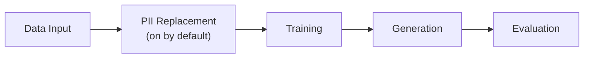

<!-- SPDX-FileCopyrightText: Copyright (c) 2025-2026 NVIDIA CORPORATION & AFFILIATES. All rights reserved. -->
<!-- SPDX-License-Identifier: Apache-2.0 -->

# Getting Started

NeMo Safe Synthesizer generates synthetic tabular data by fine-tuning a
pretrained LLM on your dataset and sampling from the trained model. This page
covers installation, a quick-start example, and a walkthrough of what the pipeline
does at each stage.

---

## Installation

### Prerequisites

- Python 3.11–3.14 (dev tooling pins 3.13 via `.python-version` in the repo root)
- CUDA runtime 12.9+
- NVIDIA GPU (A100 or larger) for training and generation

!!! failure "Linux only -- macOS, Windows, and Apple Silicon are not supported"
    NeMo Safe Synthesizer requires a Linux machine with an NVIDIA GPU and CUDA 12.9+
    to run the training and generation pipeline. The [CPU install tab below](#install-the-package)
    is for development and configuration validation only -- it cannot train models or
    generate synthetic data.

### Install the Package

!!! tip "Skip installation entirely"
    [](https://brev.nvidia.com/launchable/deploy/now?launchableID=env-3HBtA2NKQaBukL2TyDphWUcvQ17)
    [](https://brev.nvidia.com/launchable/deploy/now?launchableID=env-3HBtA2NKQaBukL2TyDphWUcvQ17)

    Deploys a GPU instance with everything below already done, plus the tutorial
    notebooks. Useful for evaluating Safe Synthesizer without a local NVIDIA GPU. The
    instance bills continuously and cannot be paused -- delete it when you are finished.

From a source checkout, use the installation helper to select a supported
runtime and its package indexes:

```bash
./install_nss.sh             # CUDA 12.9 (default)
CUDA=130 ./install_nss.sh    # CUDA 13.0
CUDA=cpu ./install_nss.sh    # CPU-only development and validation
```

The helper requires [uv](https://docs.astral.sh/uv/) and accepts `DRY_RUN=1`
to print its command without installing. CUDA 13.0 requires an NVIDIA driver
version 580.65.06 or newer.

The CUDA and CPU extras depend on packages (PyTorch, FlashInfer) hosted on
indexes outside PyPI. You must pass the extra index URLs shown below.

=== "CUDA 12.9 (Linux with NVIDIA GPU)"

    === "pip"

        ```bash
        pip install "nemo-safe-synthesizer[cu129,engine]" \
          --extra-index-url https://download.pytorch.org/whl/cu129 \
          --extra-index-url https://flashinfer.ai/whl/cu129 \
          --extra-index-url https://flashinfer.ai/whl/ \
          --extra-index-url https://wheels.vllm.ai/0.26.0/cu129
        ```

    === "uv"

        ```bash
        uv pip install "nemo-safe-synthesizer[cu129,engine]" \
          --index https://flashinfer.ai/whl/cu129 \
          --index https://flashinfer.ai/whl/ \
          --index https://download.pytorch.org/whl/cu129 \
          --index https://wheels.vllm.ai/0.26.0/cu129 \
          --index-strategy unsafe-best-match
        ```

        !!! info "Why `--index-strategy unsafe-best-match`"
            FlashInfer publishes wheels to flashinfer.ai, but `flashinfer-python`
            also appears on the PyTorch index at older versions. uv's default
            `first-match` strategy stops at the first index that contains a
            package name, so it picks up the wrong version from the PyTorch
            index and fails to resolve. `--index-strategy unsafe-best-match`
            tells uv to consider all indexes and pick the best matching version.

=== "CPU (macOS / Linux without GPU)"

    On **macOS**, PyTorch ships standard wheels on PyPI, so no extra indexes are needed.

    On **Linux**, the CPU-only PyTorch wheels (`+cpu` local version) are hosted
    on a separate PyTorch index.

    === "pip (macOS)"

        ```bash
        pip install "nemo-safe-synthesizer[cpu,engine]"
        ```

    === "pip (Linux)"

        ```bash
        pip install "nemo-safe-synthesizer[cpu,engine]" \
          --extra-index-url https://download.pytorch.org/whl/cpu
        ```

    === "uv (macOS)"

        ```bash
        uv pip install "nemo-safe-synthesizer[cpu,engine]"
        ```

    === "uv (Linux)"

        ```bash
        uv pip install "nemo-safe-synthesizer[cpu,engine]" \
          --index https://download.pytorch.org/whl/cpu \
          --index-strategy unsafe-best-match
        ```

    !!! warning "Development use only"
        The CPU install does not support training or generation. Use it to
        validate configuration, explore the CLI, or import config classes in
        code. An A100 or larger GPU is required to run the full pipeline.

=== "Docker (Linux with NVIDIA GPU)"

    ```bash
    docker run --rm --gpus all --shm-size=1g \
      --user "$(id -u):$(id -g)" \
      -v /path/to/input:/workspace/input:ro \
      -v /path/to/config:/workspace/config:ro \
      -v /path/to/artifacts:/workspace/artifacts \
      -v /path/to/hf-cache:/workspace/.hf_cache \
      ghcr.io/nvidia-nemo/safe-synthesizer:latest-cu129 \
      run --config /workspace/config/config.yaml \
      --data-source /workspace/input/input.csv \
      --artifact-path /workspace/artifacts
    ```

    The public image contains the runtime, not input data or configuration.
    `latest-cu129` is suitable for evaluation; select an approved versioned
    `cu129` tag or digest for reproducible workloads. No local Python install
    or source build is needed. See [Docker](docker.md) for tag selection,
    directory preparation, secrets, mounts, and offline usage.

=== "Bare package for config definitions"

    The bare package has no PyTorch or FlashInfer dependencies.

    === "pip"

        ```bash
        pip install "nemo-safe-synthesizer"
        ```

    === "uv"

        ```bash
        uv pip install "nemo-safe-synthesizer"
        ```

    !!! note "Limited use"
        The bare package includes only the Pydantic configuration models -- no
        training, generation, or CLI engine. Use it in the NeMo Safe Synthesizer
        Service or any Python project that needs to construct or validate
        [`SafeSynthesizerParameters`][nemo_safe_synthesizer.config.parameters.SafeSynthesizerParameters] without pulling in the full ML stack.

### Verify

After installing, activate your Python virtual environment and confirm the CLI is available:

```bash
safe-synthesizer --version
safe-synthesizer --help
```

Expected output:

```text
Usage: safe-synthesizer [OPTIONS] COMMAND [ARGS]...

  NeMo Safe Synthesizer command-line interface. This application is used to
  run the Safe Synthesizer pipeline. It can be used to train a model, generate
  synthetic data, and evaluate the synthetic data. It can also be used to
  modify a config file.

Options:
  --version  Show the version and exit.
  --help  Show this message and exit.

Commands:
  artifacts  Artifacts management commands.
  config     Manage Safe Synthesizer configurations.
  run        Run the Safe Synthesizer end-to-end pipeline.
```

### Optional Agent Skill

This repository includes an Agent Skill at `skills/safe-synthesizer/`. The
`.agents/skills/safe-synthesizer` path is a repository symlink for agents that
discover project skills from `.agents/skills/`.
When working from a source checkout, no separate install step is required.

Use it by asking an agent a Safe Synthesizer usage question, or by explicitly
invoking the skill in an agent that supports slash-style skill calls, for
example:
`/safe-synthesizer How do I run on a CSV with DP enabled?`

The skill routes common requests to task notes for running the CLI or SDK,
setting parameters, diagnosing failures, and finding artifacts. It points the
agent back to this user guide and the developer guide instead of duplicating
the full documentation. For copy-based installs into another project or a
user-level skill directory, see `skills/safe-synthesizer/README.md`.

---

## Quick Start

Create a synthetic version of an input dataset in one step by running:

```bash
safe-synthesizer run --data-source data.csv
```

You can use [Clinc OOS](https://huggingface.co/datasets/clinc/clinc_oos) as an example dataset: export the split you want (for example the training split) to a CSV file, then point `--data-source` at that file:

```bash
safe-synthesizer run --data-source clinc_oos.csv
```

Replace `data.csv` (or `clinc_oos.csv`) with your actual input file. Any `.csv`, `.json`, `.jsonl`,
`.parquet`, or `.txt` file works -- see [Running Safe Synthesizer -- Data Input](running.md#data-input) for all supported formats.

Your dataset should have at least 1,000 records (10,000 records if using [differential privacy](running.md#differential-privacy)).

Use `--log-format plain` or set `NSS_LOG_FORMAT=plain` for more readable log output when using a non-interactive terminal (for example CI or captured logs). See [Log format](running.md#log-format) for details.

The command above fine-tunes a LoRA adapter on your data, generates 1000 synthetic records,
and produces an evaluation report. The default outputs are placed in
`./safe-synthesizer-artifacts/<config>---<dataset>/<run_name>/`

- `generate/synthetic_data.csv` -- the synthetic dataset
- `generate/evaluation_report.html` -- quality and privacy scores
- `generate/evaluation_metrics.json` -- machine-readable evaluation scores and timing
- `train/adapter/` -- trained adapter (reusable for more generation)

To run the same pipeline from Python, see [Running Safe Synthesizer -- SDK](running.md#running-the-pipeline).

→ Next step: read [Evaluation](../product-overview/evaluation.md) to understand
your first report and how to interpret SQS and DPS scores.

---

## How the Pipeline Works

The pipeline has five stages. Each is independently configurable -- you can
run the full pipeline in one step, or execute stages individually (train once,
generate many times). You can find a brief overview of each stage below, or read [Pipeline](../product-overview/pipeline.md) for in-depth descriptions.



### 1. Data Input

The pipeline loads your input data (CSV, JSON, JSONL, Parquet, or DataFrame)
and prepares it for training:

- Column type inference and validation
- [Grouping and ordering](../developer-guide/example-generation.md) (if configured via `data.group_training_examples_by` and `data.order_training_examples_by`)
- Train/test split -- a holdout set (default 5%) is reserved for evaluation
- Records are serialized to JSONL and tokenized; records that exceed the
  model's context window raise a [`GenerationError`][nemo_safe_synthesizer.errors.GenerationError] rather than being silently
  truncated

Your dataset should have at least 1,000 records (10,000 records if enabling differential privacy).

### 2. PII Replacement

PII replacement is on by default as a pre-processing step. The PII replacer detects
personally identifiable information (PII) using GLiNER NER and optional LLM-based
column classification, then replaces detected entities with synthetic but
realistic values prior to fine-tuning. This ensures the model never has the opportunity to learn the most sensitive information (e.g. names, addresses, identifiers) from the training data. See [Supported Entity Types](../product-overview/pii_replacement.md#supported-entity-types) for the full entity list.

See [Configuration -- Replacing PII](configuration.md#replacing-pii) for
entity types, LLM classification setup, and SDK customization.

### 3. Training

Fine-tunes a base LLM using LoRA (Low-Rank Adaptation). One backend is available
(HuggingFace) see [Running -- Training](running.md#training).

The default model is `HuggingFaceTB/SmolLM3-3B`. Safe Synthesizer has tested support for `HuggingFaceTB/SmolLM3-3B`, `TinyLlama/TinyLlama-1.1B-Chat-v1.0`, and `mistralai/Mistral-7B-Instruct-v0.3` (see [Configuration -- Training](configuration.md#training) for details on how to change the model or hyperparameters).

Training requires 1 NVIDIA GPU (A100 or larger) to run. Multi-GPU training is not supported.

!!! tip "Differential privacy"
    For formal privacy guarantees, enable Differentially Private Stochastic Gradient Descent (DP-SGD) when fine-tuning via `privacy.dp_enabled: true`. See [Configuration -- Differential Privacy](configuration.md#differential-privacy).

### 4. Generation

Produces synthetic records using the trained LoRA adapter via vLLM. The
generation stage samples from the fine-tuned model until the requested number
of valid records is reached, with configurable stopping conditions for quality
control.

See [Configuration -- Generation](configuration.md#generation).

### 5. Evaluation

Measures quality and privacy of the synthetic data and produces an HTML report
with interactive visualizations. Two composite scores are reported:

- SQS (Synthetic Quality Score) -- composite quality score with five subscores:
    - Column Correlation Stability -- measures the correlation across every combination of two numeric and categorical columns
    - Deep Structure Stability -- compares numeric and categorical columns in the training and synthetic data using Principal Component Analysis (PCA)
    - Column Distribution Stability -- measures the distribution of each numeric and categorical column
    - Text Structure Similarity -- measures the sentence, word, and character counts for text columns
    - Text Semantic Similarity -- measures whether the semantic meaning in text columns held after synthesizing
- DPS (Data Privacy Score) -- composite privacy score with three subscores:
    - Membership Inference Protection -- measures whether a model trained on the data can distinguish training records from held-out records
    - Attribute Inference Protection -- measures whether an attacker can infer a sensitive attribute from quasi-identifiers in the synthetic data
    - PII Replay Detection -- checks whether PII from training appears in synthetic data

See [Evaluation](../product-overview/evaluation.md) for how to interpret scores.

---

## What to Read Next

After your first run, read [Evaluation](../product-overview/evaluation.md) to understand your SQS and DPS scores and [Synthetic Data Quality](evaluating-data.md) to learn how to improve generation quality. If your job failed to run, read [Troubleshooting](troubleshooting.md) to learn how to fix common errors.

## Guides

<div class="grid cards" markdown>

-   Configuration

    ---

    Synthesis parameters for training, generation, PII, DP, evaluation,
    and time series.

    [→ Configuration](configuration.md)

-   Running Safe Synthesizer

    ---

    How to run the pipeline, CLI commands, individual stages, logging,
    and artifacts.

    [→ Running Safe Synthesizer](running.md)

-   Environment Variables

    ---

    Artifact paths, logging, model caching, NIM endpoints, and WandB.

    [→ Environment Variables](environment.md)

-   Troubleshooting

    ---

    Common errors, OOM fixes, offline setup, and configuration gotchas.

    [→ Troubleshooting](troubleshooting.md)

-   Synthetic Data Quality

    ---

    Improving generation quality, the quality-privacy tradeoff, and unavailable metrics.

    [→ Synthetic Data Quality](evaluating-data.md)

</div>
